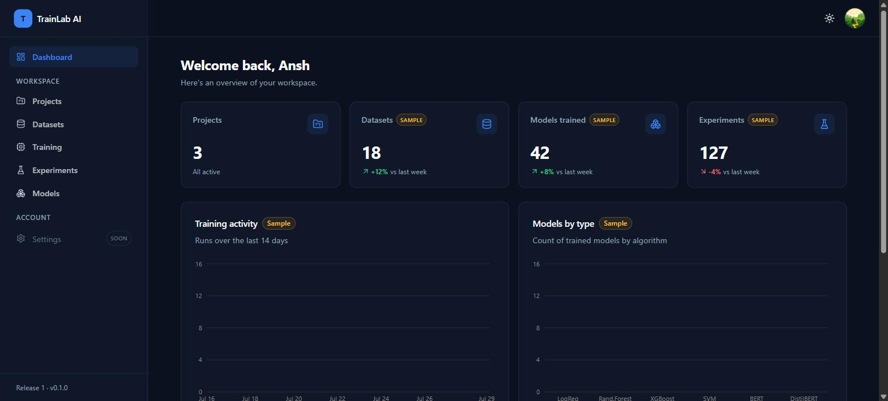
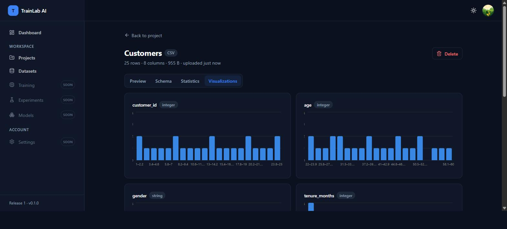
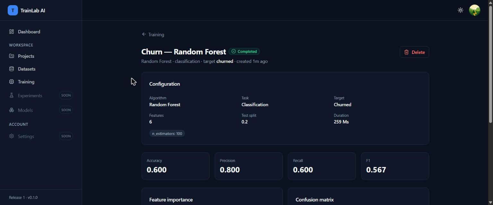
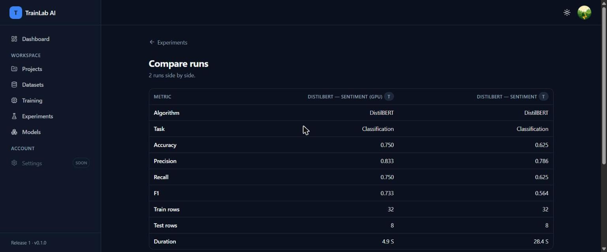
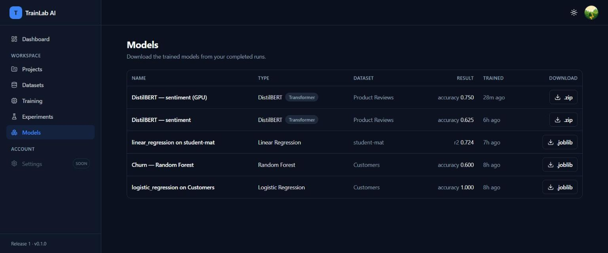

<div align="center">

# TrainLab AI

**The Modern AI Training & MLOps Platform**

Upload data, train classical ML **and** transformer models, compare experiments,
and download your models — all from one polished workspace.




</div>

---

> **Status: Release 1 — Portfolio Ready ✅ (complete)**
> A full, deployable AI platform: secure OAuth, projects, datasets, classical &
> transformer training (GPU-accelerated), experiment comparison, and model
> downloads. Built to grow across three planned releases without rewrites.

## Features

- 🔐 **Authentication** — sign in with **Google** or **GitHub** (backend-owned
  OAuth, stateless JWT session, protected routes).
- 📁 **Projects** — organize your work; full create/edit/archive/delete.
- 📊 **Datasets** — upload **CSV/JSON**, with automatic **schema detection**,
  **statistics**, a data **preview**, and per-column **distribution charts**.
- 🧠 **Classical ML training** — Logistic/Linear Regression, Random Forest,
  XGBoost, SVM, KNN, Decision Tree — **classification & regression**, with a
  configurable pipeline (impute → one-hot → scale), live progress, and cancel.
- 🤖 **Transformer fine-tuning** — **BERT / DistilBERT / RoBERTa** for text
  classification, with checkpoint saving and automatic **GPU detection**.
- 🔬 **Experiments** — run history, metrics, and **side-by-side comparison** with
  charts (accuracy / F1 / R²).
- 📦 **Models** — download trained artifacts (`.joblib` pipelines, transformer
  checkpoint `.zip`s).
- 🎨 **Polished UI** — responsive, dark mode, accessible, data-viz-consistent.

## Screenshots

| Dataset inspector | Experiment results |
| --- | --- |
|  |  |

| Compare runs | Model registry |
| --- | --- |
|  |  |

## Tech stack

| Layer | Technology |
| --- | --- |
| Frontend | Next.js 14 (App Router), TypeScript, Tailwind CSS, shadcn/ui, Recharts |
| Backend | FastAPI, Python 3.12, SQLAlchemy 2.0, Alembic, Pydantic v2 |
| ML | scikit-learn, XGBoost, PyTorch, HuggingFace Transformers |
| Database | PostgreSQL 16 |
| Cache / Queue | Redis 7 *(provisioned, reserved for Release 2)* |
| Orchestration | Docker & Docker Compose |

## Quick start (Docker)

```bash
cp .env.example .env          # then set SECRET_KEY and (optionally) OAuth creds
docker compose up --build
```

Then open:

- **App:** http://localhost:3000
- **API docs:** http://localhost:8000/docs

> The backend image includes PyTorch + Transformers, so the first build is large
> and takes a few minutes. Migrations run automatically on container start.

To enable Google/GitHub sign-in, register OAuth apps and fill in `.env` — see
**[`docs/AUTH_SETUP.md`](docs/AUTH_SETUP.md)**. Without credentials the app still
runs (the provider buttons are simply disabled).

## Local development (without Docker)

**Backend** (Python 3.12+):

```bash
cd backend
python -m venv .venv
# Windows: .venv\Scripts\activate  |  macOS/Linux: source .venv/bin/activate
pip install -r requirements-dev.txt
# GPU users: swap in the CUDA torch build (see requirements.txt)
cp .env.example .env            # a local sqlite DB works out of the box
alembic upgrade head
uvicorn app.main:app --reload
```

**Frontend** (Node 20+):

```bash
cd frontend
npm install
npm run dev
```

See **[`docs/DEVELOPMENT.md`](docs/DEVELOPMENT.md)** for details (GPU setup,
migrations, ports).

## Testing

```bash
cd backend  && pytest            # 38 tests: auth, CRUD, datasets, training, download
cd frontend && npm test          # Vitest unit tests
cd frontend && npm run build      # type-check + lint + production build
```

## Project structure

```
TrainLab-AI/
├── backend/      # FastAPI: versioned API, models, services (ML + transformers), tests
├── frontend/     # Next.js app (Tailwind + shadcn/ui)
├── docker/       # Postgres bootstrap
├── docs/         # Architecture, roadmap, development, auth setup, screenshots
└── docker-compose.yml
```

See [`docs/ARCHITECTURE.md`](docs/ARCHITECTURE.md) for the design and
[`docs/ROADMAP.md`](docs/ROADMAP.md) for the full three-release plan.

## License

[MIT](LICENSE) © Ansh Kumar
